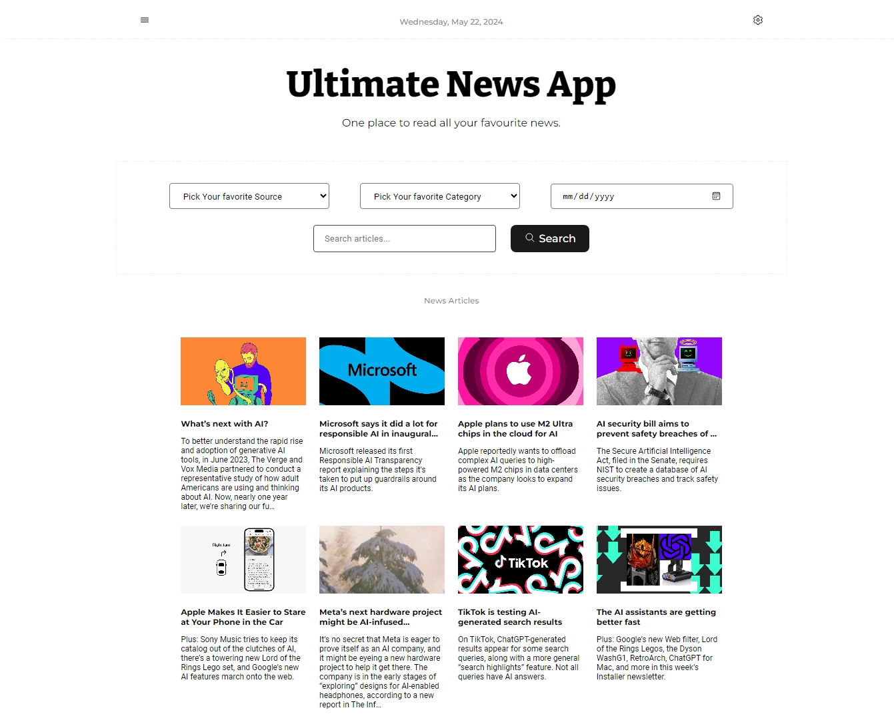

# Ultimate News App

## Description

The Ultimate News App is a modern web application that aggregates news articles from various sources such as NewsAPI, The Guardian, and The New York Times. Users can set their preferences for authors, sources, and categories, and search for specific articles.

### Mobile View


### Desktop View



## Features

- Aggregate news from multiple sources
- Set preferences for authors, sources, and categories
- Search for news articles
- Responsive design for mobile and desktop

## Technologies Used

- **React**: A JavaScript library for building user interfaces.
- **React Redux**: A predictable state container for JavaScript apps, used for managing application state.
- Sass
- Vite
- Axios
- Docker

## Installation

1. Clone the repository:

   ```bash
   git clone https://github.com/imshivamgupta/ultimate-news-app.git
   ```

2. Install dependencies:

   ```bash
   cd ultimate-news-app
   npm install
   ```

3. Environment Variables
   Create a .env file in the root of the project and add your API keys:
   `VITE_NEWS_API_KEY=your_newsapi_key
VITE_GUARDIAN_API_KEY=your_guardian_key
VITE_NYT_API_KEY=your_nyt_key`

## Usage

Start the development server:

```bash
npm run dev
```

# Docker

`docker build -t ultimate-news-app .
`

### Run the Docker Container

`docker run -p 3000:3000 ultimate-news-app
`

### Usage

- Visit http://localhost:3000 to access the application.
- Use the search bar to search for news articles.
- Set your preferences by clicking the settings icon and saving your preferred authors, sources, and categories.
